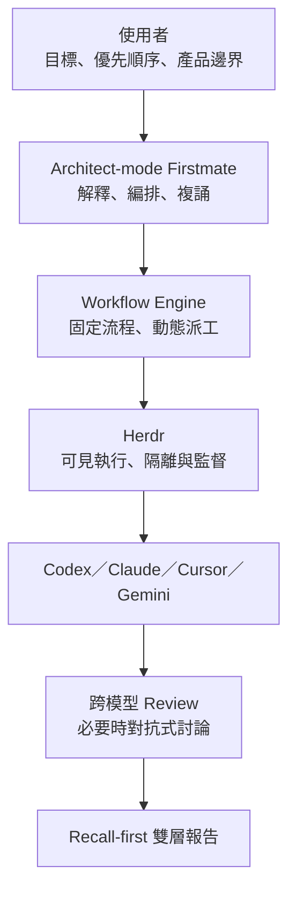

# AI Coding Mate

AI Coding Mate 是一個給 AI vibe coder 使用的架構控制層。你只需要說明目標、優先順序與不能碰的邊界；系統負責把技術工作交給 Firstmate、Herdr 與不同模型，並把結果整理成能直接閱讀的報告。

> 目前狀態：v0.1 規格已確認，repository 先以 spec-first 方式建立；執行程式尚未發布。

## 它要解決什麼

近期 coding agent 常把「避免犯錯」做成「少講、少做、反覆警告」：

- 搜尋與報告的 recall 太低，重要候選內容過早被刪除。
- specificity 過度優先，每段內容都附帶防禦性說明。
- 技術問題反覆回頭詢問使用者，打斷架構層級的決策。
- 多模型雖然能平行工作，卻缺少固定、可預期的 review 與收斂流程。

AI Coding Mate 的預設方向相反：先追求完整涵蓋，再標示證據成熟度；技術細節留在可展開層，不污染主要報告。

## 大架構

AI Coding Mate 是薄薄的控制層，不是 Firstmate fork，也不取代 Herdr：

- **AI Coding Mate**：決定目標、權限、流程、模型角色與報告形式。
- **Firstmate**：擔任 Architect 與主要派工／監督者。
- **Herdr**：提供可見的 agent runtime、工作區與 plugin surface。
- **Codex／Claude／Cursor／Gemini**：依角色執行、搜尋、review 或裁決。

## v0.1 核心能力

- Architect 自動處理可逆的技術決策。
- 只有成本、敏感資料、外部行動或不可逆操作需要使用者確認。
- 固定 workflow 骨架，動態選擇任務、模型與 worker 數量。
- 高風險任務採跨模型 adversarial review；小任務單次 review 或抽查。
- 報告使用 recall-first 雙層格式，另設 Coverage Review 找出遺漏。
- 選取文字後可開啟 Context Branch，先白話說明，再按需深入。
- Branch 內容可帶回原主對話，由主對話判斷新增或修改任務並複誦。
- `Open in Codex Review` 直接使用 Codex 原生 review／annotation 介面。
- 沿用既有 Claude Code／Codex skills 與 adapters，不改寫內部 prompt。

完整需求見 [產品規格](docs/SPEC.md)，系統邊界見 [架構說明](docs/ARCHITECTURE.md)，交付順序見 [實作計畫](docs/IMPLEMENTATION_PLAN.md)。

## 設定方式

v0.1 將提供兩個入口，內容等價：

1. 給一般使用者的設定畫面。
2. 給進階使用者與版本控制使用的 YAML 設定檔。

目前範例：

- [Captain Preference](config/captain-preference.example.yaml)
- [Decision Policy](config/decision-policy.example.yaml)
- [Model Policy](config/model-policy.example.yaml)
- [Workflow Recipes](config/workflows.example.yaml)
- [Adapter Registry](config/adapters.example.yaml)

模型名稱不寫死。設定檔使用「最強推理」、「平衡建置」、「快速搜尋」等邏輯角色，再由 adapter 對應到當下可用的實際模型。

## 上游相容性基準

初始規格以以下版本點作為可重現的研究基準，不代表已完成 runtime 驗證：

- Firstmate：`kunchenguid/firstmate@e595611291247368b982eb729097c54f2b45aa78`
- Herdr：`herdrdev/herdr@v0.7.5`

Firstmate 採 MIT License；Herdr 與本 repository 採 Apache License 2.0。AI Coding Mate 初期透過公開整合面使用兩者，不複製或修改上游主程式。

## 專案原則

1. **Architect-first**：使用者做產品判斷，不被迫理解所有技術細節。
2. **Recall-first**：候選資訊先保留，再標示成熟度，而不是過早刪除。
3. **Deterministic skeleton**：流程骨架固定，派工內容動態。
4. **Central authority**：worker 不私下互相派工，主 Architect 保留上下文與責任。
5. **Progressive disclosure**：先給可讀結論，證據與技術內容按需展開。
6. **Read-back before consequence**：外部、敏感、昂貴或不可逆行動前必須複誦並確認。

## License

[Apache License 2.0](LICENSE)
