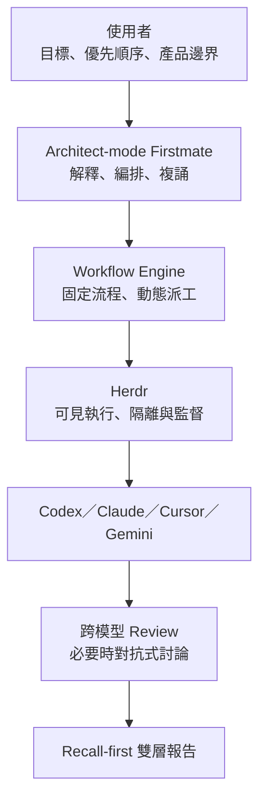

# AI Coding Mate

AI Coding Mate 是一個給 AI vibe coder 使用的架構控制層。你只需要說明目標、優先順序與不能碰的邊界；系統負責把技術工作交給 Firstmate、Herdr 與不同模型，並把結果整理成能直接閱讀的報告。

> 目前狀態：v0.2 已把 Firstmate Workflow Authority 與 canonical Run Registry 接到 Standard、Adversarial、Research 與 Codex native review。Quick 是 Firstmate 的下游執行 primitive，接受同一 idempotency key；Context Branch 則維持一次性、可稽核的回傳通道，不取得 workflow 決策權。

## 它要解決什麼

近期 coding agent 常把「避免犯錯」做成「少講、少做、反覆警告」：

- 搜尋與報告的 recall 太低，重要候選內容過早被刪除。
- specificity 過度優先，每段內容都附帶防禦性說明。
- 技術問題反覆回頭詢問使用者，打斷架構層級的決策。
- 多模型雖然能平行工作，卻缺少固定、可預期的 review 與收斂流程。

AI Coding Mate 的預設方向相反：先追求完整涵蓋，再標示證據成熟度；技術細節留在可展開層，不污染主要報告。

## 大架構



AI Coding Mate 是薄薄的控制層，不是 Firstmate fork，也不取代 Herdr：

- **AI Coding Mate**：決定目標、權限、流程、模型角色與報告形式。
- **Firstmate**：擔任 Architect 與主要派工／監督者。
- **Herdr**：提供可見的 agent runtime、工作區與 plugin surface。
- **Codex／Claude／Cursor／Gemini**：依角色執行、搜尋、review 或裁決。

## 核心能力

- Architect 自動處理可逆的技術決策。
- 只有成本、敏感資料、外部行動或不可逆操作需要使用者確認。
- 固定 workflow 骨架，動態選擇任務、模型與 worker 數量。
- 高風險任務採跨模型 adversarial review；小任務單次 review 或抽查。
- 報告使用 recall-first 雙層格式，另設 Coverage Review 找出遺漏。
- 選取文字後可開啟 Context Branch，先白話說明，再按需深入。
- Branch 內容可帶回原主對話，由主對話判斷新增或修改任務並複誦。
- `Open in Codex Review` 直接使用 Codex 原生 review／annotation 介面。
- 沿用既有 Claude Code／Codex skills 與 adapters，不改寫內部 prompt。

先從 [繁體中文使用說明](docs/USER_GUIDE.zh-TW.md) 開始。完整需求見 [產品規格](docs/SPEC.md)，系統邊界見 [架構說明](docs/ARCHITECTURE.md)，交付順序見 [實作計畫](docs/IMPLEMENTATION_PLAN.md)，Codex review handoff 現況見 [Codex Review Handoff 可行性](docs/CODEX_REVIEW_FEASIBILITY.md)。

## 設定方式

設定可透過兩種等價入口表達：

1. 給一般使用者的設定畫面。
2. 給進階使用者與版本控制使用的 YAML 設定檔。

目前範例：

- [Captain Preference](config/captain-preference.example.yaml)
- [Decision Policy](config/decision-policy.example.yaml)
- [Model Policy](config/model-policy.example.yaml)
- [Workflow Recipes](config/workflows.example.yaml)
- [Adapter Registry](config/adapters.example.yaml)

Workflow recipe 不寫死 provider model ID。設定檔使用「最強推理」、「平衡建置」、「快速搜尋」等邏輯角色，再由可覆寫的 adapter policy 對應到當下可用的實際模型。

## T1：從 Herdr 開啟診斷面

AI Coding Mate 目前提供一條最小可用路徑：安裝 dependencies、link 成 Herdr local plugin，然後開啟診斷 pane。

```bash
bun install
bun bin/aicoding-mate link
bun bin/aicoding-mate open
```

也可以直接檢查 CLI 與 doctor：

```bash
bun bin/aicoding-mate --help
bun bin/aicoding-mate doctor
bun bin/aicoding-mate doctor --json
```

doctor 的每個項目都來自 runtime read-back：Herdr 會讀 `herdr status server` 與 `herdr api snapshot`，其他工具會執行各自的 `--version`。缺少工具時，輸出會列出可執行的下一步。Herdr plugin pane 使用 `herdr-plugin.toml` 中的 argv command；Herdr 不做 shell expansion，因此 pane entrypoint 只依賴 plugin runtime 的工作目錄與 `HERDR_PLUGIN_*` 環境變數。

## T2：從 Herdr 派出 Firstmate Quick 任務

先建立 pinned、pristine 的 Firstmate distro 與隔離 `FM_HOME`，再從 Herdr 開啟 Quick pane：

```bash
bun bin/aicoding-mate bootstrap-firstmate
bun bin/aicoding-mate open --entrypoint quick
```

Quick pane 只接受明確唯讀的檢查、搜尋、摘要、解釋或 review 任務；其他意圖會在派工前導向正式 workflow。控制通道明確分成兩個方向：

- Herdr pane 到 Firstmate：`fm-brief.sh` 寫入本次 task，`fm-spawn.sh` 建立隔離 worktree 與 Codex worker。
- Firstmate 回到 Herdr pane：`fm-peek.sh`、status 與 report 形成結果；CLI 輸出後再用 `herdr pane read` 從來源 pane 讀回同一內容。

AI Coding Mate 不修改 pinned Firstmate clone；它以 app-owned PATH adapter 把 Firstmate 的 Codex worker 從 upstream 的 full-access launch 收斂為 `workspace-write`、無 approval prompt、command network 關閉。可寫範圍只包含 Treehouse 隔離 worktree 與本次 `FM_HOME` report/status，並停用 web search 與 MCP server 設定。

每次 run 會留下 JSON record，記錄 task、source pane、worker pane、control channel、evidence paths、狀態與結果。只有來源 pane 仍存在、worker pane 可見、worker 位於獨立 git worktree，而且來源 pane runtime read-back 與 durable result 一致時，四項 claims 才全部為 `true`：

```bash
bun bin/aicoding-mate read-run state/aicoding-mate/runs/<run-id>.json
```

若 bootstrap 或 spawn 失敗，先依 pane 中的 blocker 修正，再執行 `bootstrap-firstmate` 並從新的 Quick pane 重試；系統不會把缺少登入、工具、pane、隔離 worktree 或 read-back 的情況包裝成成功。

## 其他 Herdr 工作面

```bash
bun bin/aicoding-mate open --entrypoint standard
bun bin/aicoding-mate open --entrypoint adversarial
bun bin/aicoding-mate open --entrypoint research
```

- Standard：Firstmate/Codex 形成方案，再做跨模型 review。
- Adversarial：Author、Challenger、Judge 最多兩輪收斂。
- Research：保留高 recall discovery denominator、成熟度與 coverage。
- Context Branch：從 Herdr selection action 開啟，最後複誦並明確確認後才送回來源任務。
- Codex Review：從 Herdr selection action 建立 detached native review，Review Capsule 完成與 desktop deep-link request 分開驗證。

主畫面只顯示結論、影響、下一步與 evidence 路徑；完整模型輸出、未知項目與 lineage 保留在 durable record。

## v0.2 Authority

v0.2 落實兩個 authority：

- **Workflow Authority**：Firstmate 是 Author、Reviewer、Challenger、Judge、Report Composer、fallback 與停止條件的唯一 decision writer；Adapter 只回報能力與執行 exact assignment。
- **Runtime Authority**：Run Registry 以 stable idempotency key 管理 canonical run、attempt、dispatch receipt、lease、`unknown_outcome` reconciliation 與 append-only hash-chain lineage。

受管 workflow 的 durable record 只有在 decision、registry、artifact 與 lineage 全部讀回一致後，才標示 `firstmate_verified` 與 `canonical_run_registry_verified`。逾時或 receipt 遺失會進入 `unknown_outcome`，先查既有結果，不直接重派。詳細契約與限制見 [產品規格第 9 節](docs/SPEC.md#9-v02-核心兩個-authority)。

安裝或 link Herdr plugin 代表在本機以使用者權限執行此 repository 的程式碼；請先檢查 `herdr-plugin.toml`、`bin/aicoding-mate` 與 `src/`。

## 上游相容性基準

初始規格以以下版本點作為可重現的研究基準，不代表已完成 runtime 驗證：

- Firstmate：`kunchenguid/firstmate@e595611291247368b982eb729097c54f2b45aa78`
- Herdr：`herdrdev/herdr@v0.7.5`

Firstmate 採 MIT License；Herdr 與本 repository 採 Apache License 2.0。AI Coding Mate 初期透過公開整合面使用兩者，不複製或修改上游主程式。

## 專案原則

1. **Architect-first**：使用者做產品判斷，不被迫理解所有技術細節。
2. **Recall-first**：候選資訊先保留，再標示成熟度，而不是過早刪除。
3. **Deterministic skeleton**：流程骨架固定，派工內容動態。
4. **Central authority**：worker 不私下互相派工，主 Architect 保留上下文與責任。
5. **Progressive disclosure**：先給可讀結論，證據與技術內容按需展開。
6. **Read-back before consequence**：外部、敏感、昂貴或不可逆行動前必須複誦並確認。

## License

[Apache License 2.0](LICENSE)
