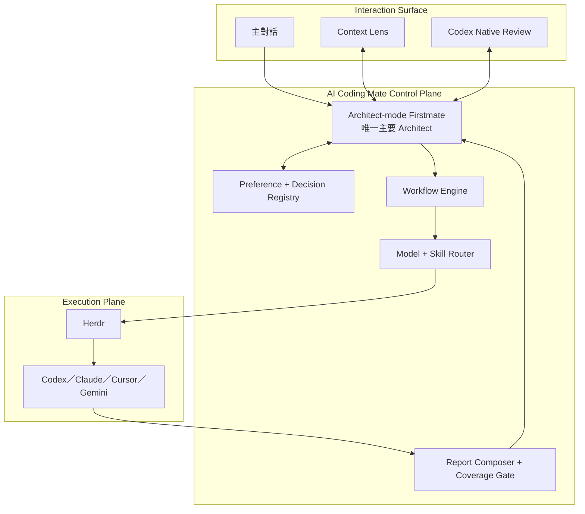
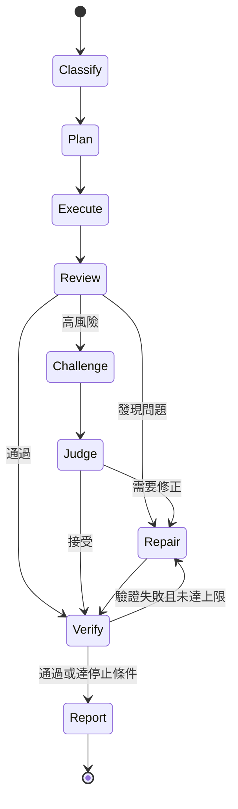
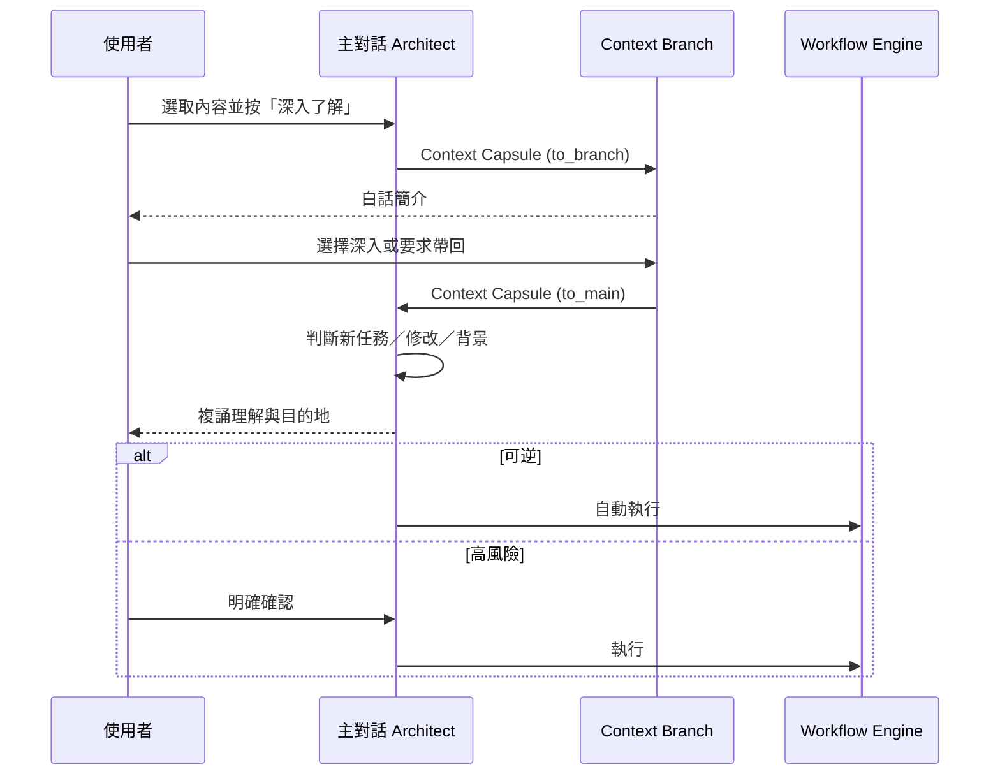

# 架構說明

## 1. 架構判斷

AI Coding Mate 採「薄控制層」而不是修改 Firstmate：

這個分法讓上游可以更新，同時避免上游的自然語言派工習慣直接決定產品權限與 workflow。

## 2. 各層責任

### Interaction Surface

- 顯示一頁主報告與可展開的證據層。
- 讓使用者選取內容、開啟 Context Branch。
- 透過 deep link 或 app-server handoff 開啟 Codex 原生 review。
- 不直接決定模型與執行權限。

### Architect-mode Firstmate

- 理解使用者目標與目前 task 語意。
- 讀取 Captain Preference 與 Decision Policy。
- 選擇 workflow recipe。
- 將 context 壓縮成 capsule。
- 對結果負責並向使用者複誦。
- AI Coding Mate 的 policy 與 workflow 模組包在這個 Firstmate session 周圍，不形成第二個常駐 Architect agent。

### Preference + Decision Registry

- 保存持久偏好與產品決策。
- 產生 Firstmate 可讀的 `captain.md`／`captain-shared.md`。
- 將「溝通偏好」與「強制權限」分開。
- 以 append-only decision lineage 避免偏好被無聲覆寫。

### Workflow Engine

- 管理固定狀態機、barrier、最大回合與停止條件。
- 接受 Architect 動態產生的 task、角色與 worker 數量。
- 不把 routing 交給自由形式 prompt 單獨決定。

通用狀態：

### Model + Skill Router

- 將角色對應到 model alias、fallback 與最低能力。
- 從 Skill Registry 找到符合能力契約的 skill。
- 從 Adapter Registry 找到可用 runtime。
- 確保 author／reviewer 優先來自不同模型家族。

### Report Composer + Coverage Gate

- 組合主報告與證據層。
- 保留候選資訊的狀態，不用刪除來表達不確定性。
- 用獨立 coverage pass 對照原始需求與最後輸出。

### Firstmate + Herdr

- Firstmate 是唯一主要 liaison／Architect。
- Herdr 是可見 runtime，負責 pane、tab、worktree 與 plugin context。
- Firstmate 經 Herdr 執行，不反向把 Firstmate 嵌入 Herdr 核心。
- AI Coding Mate 透過公開設定與 adapter surface 約束 Firstmate 的偏好、權限與 workflow，不在 Firstmate 上方增加另一個 agent。

## 3. 核心資料契約

### Intent Capsule

包含：

- 使用者想達成的結果。
- 完成條件。
- 已知邊界。
- 風險等級。
- 原 task 與來源。

### Context Capsule

包含：

- 傳送方向：`to_branch` 或 `to_main`。
- 被選取的原文或數字。
- 所在段落與來源 artifact。
- 主對話目前目標。
- 已知決策與禁止事項。
- 回傳目的地。

### Review Capsule

包含：

- reviewer 身分與模型家族。
- findings 與優先級。
- 反例、遺漏和證據。
- 已完成的修訂。
- 未解決問題。
- 建議帶回的 task mutation。

### Report Package

包含：

- `main_report`：可以獨立閱讀的第一層。
- `evidence_layer`：來源、成熟度、技術細節。
- `coverage_result`：原始要求到輸出段落的對照。
- `decision_summary`：本次自動決策與需要確認的事項。

## 4. Context Branch 往返

主對話是唯一 mutation authority。Branch 可以研究與建議，但不能直接改變主任務。

## 5. Codex Review Handoff

v0.1 的目標是直接借用 Codex 原生介面。以下流程擬以官方文件描述的 app-server、deep link 與 review surfaces 實作；每一項能力都必須先通過本專案的 runtime capability probe，完整往返也必須通過 end-to-end 驗證：

1. Architect 產生 Context Capsule 與 review 指令。
2. Codex adapter 使用 app-server 建立／fork task。
3. 介面以 `codex://` deep link 打開該 task。
4. 使用者在原生 review pane 選取與批註。
5. Codex 完成修訂或產生 findings。
6. Adapter 讀取結果並建立 Review Capsule。
7. 主 Architect 複誦後整合。

不把 Codex 私有 UI component 複製進 Herdr；若 Codex 原生介面不可用，v0.1 的 fallback 是文字化 Review Capsule，不自行建立第二套 annotation editor。

## 6. 權限與風險分級

| 等級 | 典型工作 | 預設 workflow | 使用者確認 |
| --- | --- | --- | --- |
| Low | 搜尋、小型可逆修改 | `quick` | 不需要 |
| Medium | 一般功能、跨檔案修改 | `standard` | 只有外部或敏感操作 |
| High | 架構、大型重構、公開內容 | `adversarial` | consequence 前確認 |
| Critical | PHI、credential、不可逆或重大成本 | `adversarial` + fail-closed | 必須明確確認 |

Review 強度依風險提升，不讓所有小任務都承受完整辯論成本。

## 7. Adapter 邊界

Adapter 只負責：

- 啟動／連接 runtime。
- 傳送 capsule。
- 串流或讀取結果。
- 回報可用模型與能力。
- 將 provider-specific 結果轉成共同 capsule。

Adapter 不得：

- 自行改寫 Decision Policy。
- 私下建立未登錄的 worker。
- 在未經 Architect 的情況下執行外部或不可逆操作。
- 把 provider model ID 寫進 workflow recipe。

## 8. 上游策略

初期策略：

- Firstmate 固定到 commit `e595611291247368b982eb729097c54f2b45aa78`。
- Herdr 固定到 release `v0.7.5`。
- 使用 Firstmate 的 Captain 與 crew-dispatch override surface。
- 使用 Herdr plugin context、popup／tab 與 socket API。
- 若薄層無法表達必要行為，先提出最小 upstream contribution。
- 只有在公開 extension surface 確實不足時，才重新評估長期 fork。

版本固定只代表相容性目標。每次升級仍需跑 end-to-end workflow、權限與 report regression。
