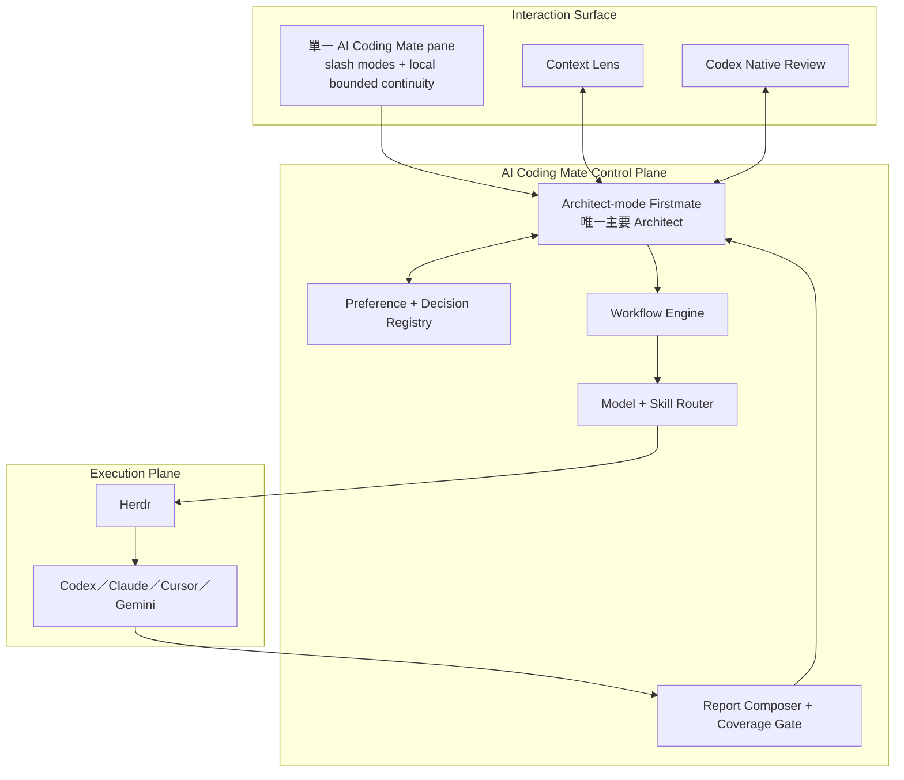
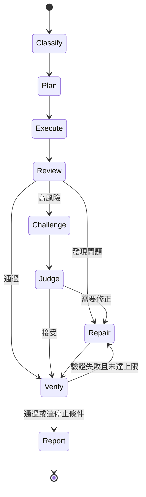
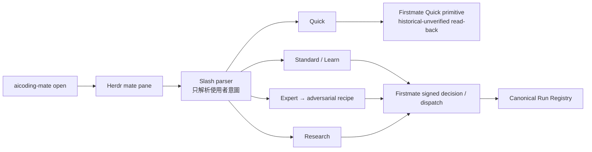
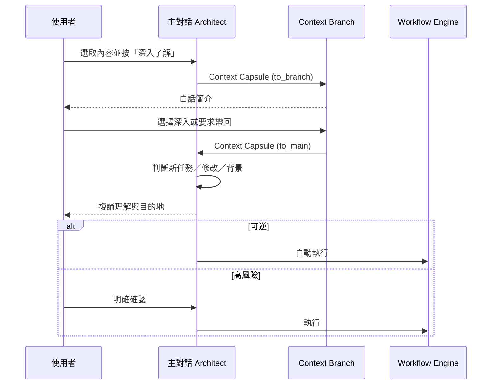
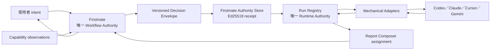
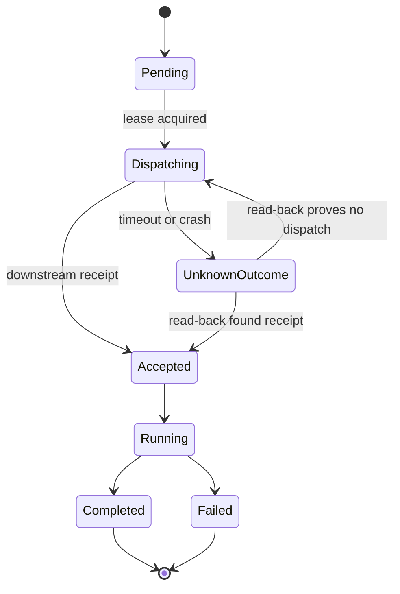

# 架構說明

## 1. 架構判斷

AI Coding Mate 採「薄控制層」而不是修改 Firstmate：



這個分法讓上游可以更新，同時避免上游的自然語言派工習慣直接決定產品權限與 workflow。

## 2. 各層責任

### Interaction Surface

- 顯示一頁主報告與可展開的證據層。
- 一般使用只暴露一個 `mate` pane；`/quick`、`/standard`、`/expert`、`/research`、`/learn` 表達當前意圖。
- 保留最近四輪精簡摘要作為 pane-local continuity state；它與本輪 executable task 是不同資料欄位。
- 只有本輪 `currentTask` 進入 Firstmate decision、scope gate、run identity 與 worker；歷史內容不自動重新注入。
- 讓使用者選取內容、開啟 Context Branch。
- 透過 deep link 或 app-server handoff 開啟 Codex 原生 review。
- 不直接決定模型與執行權限。

### Architect-mode Firstmate

- 理解使用者目標與目前 task 語意。
- 讀取 Captain Preference 與 Decision Policy。
- 選擇 workflow recipe。
- 將 context 壓縮成 capsule。
- 對結果負責並向使用者複誦。
- AI Coding Mate 的 policy 與 workflow 模組包在這個 Firstmate session 周圍，不形成第二個常駐 Architect agent。

### Preference + Decision Registry

- 保存持久偏好與產品決策。
- 產生 Firstmate 可讀的 `captain.md`／`captain-shared.md`。
- 將「溝通偏好」與「強制權限」分開。
- 以 append-only decision lineage 避免偏好被無聲覆寫。

### Workflow Engine

- 管理固定狀態機、barrier、最大回合與停止條件。
- 接受 Architect 動態產生的 task、角色與 worker 數量。
- 不把 routing 交給自由形式 prompt 單獨決定。

通用狀態：



### Model + Skill Router

- 將角色對應到 model alias、fallback 與最低能力。
- 從 Skill Registry 找到符合能力契約的 skill。
- 從 Adapter Registry 找到可用 runtime。
- 確保 author／reviewer 優先來自不同模型家族。

### Report Composer + Coverage Gate

- 組合主報告與證據層。
- 保留候選資訊的狀態，不用刪除來表達不確定性。
- 用獨立 coverage pass 對照原始需求與最後輸出。

### Firstmate + Herdr

- Firstmate 是唯一主要 liaison／Architect。
- Herdr 是可見 runtime，負責 pane、tab、worktree 與 plugin context。
- Firstmate 經 Herdr 執行，不反向把 Firstmate 嵌入 Herdr 核心。
- AI Coding Mate 透過公開設定與 adapter surface 約束 Firstmate 的偏好、權限與 workflow，不在 Firstmate 上方增加另一個 agent。

### 單一入口的控制流



Slash parser 不選 provider model、不執行 fallback、不修改 workflow barrier。console 以結構化 `MateRuntimeRequest` 分開 `currentTask` 與 `continuityContext`；dispatch 只接受前者，後者保留在 pane 互動層。若歷史決策要成為新任務的一部分，必須由使用者在本輪複誦，或經確認過的 Context Capsule 回到主 session，再重新通過 scope gate。`Learn` 只為 Standard 增加 architect-first、progressive-disclosure 的本輪任務說明；它不建立第二套 execution authority。Quick 仍是 Firstmate 下游 primitive，其歷史 record 不會被升格成 signed canonical authority。舊的 direct CLI recipe commands 只保留給 automation 與診斷，不是另一組一般使用介面。

## 3. 核心資料契約

### Intent Capsule

包含：

- 使用者想達成的結果。
- 完成條件。
- 已知邊界。
- 風險等級。
- 原 task 與來源。

### Context Capsule

包含：

- 傳送方向：`to_branch` 或 `to_main`。
- 被選取的原文或數字。
- 所在段落與來源 artifact。
- 主對話目前目標。
- 已知決策與禁止事項。
- 回傳目的地。

### Review Capsule

包含：

- reviewer 身分與模型家族。
- findings 與優先級。
- 反例、遺漏和證據。
- 已完成的修訂。
- 未解決問題。
- 建議帶回的 task mutation。

### Report Package

包含：

- `main_report`：可以獨立閱讀的第一層。
- `evidence_layer`：來源、成熟度、技術細節。
- `coverage_result`：原始要求到輸出段落的對照。
- `decision_summary`：本次自動決策與需要確認的事項。

## 4. Context Branch 往返



主對話是唯一 mutation authority。Branch 可以研究與建議，但不能直接改變主任務。

## 5. Codex Review Handoff

v0.2 直接借用 Codex 原生介面。流程使用官方 Codex App Server 的 `thread/start`、`review/start` 與 `thread/read`；每一項能力都必須先通過 runtime capability probe，完整往返也必須通過 end-to-end 驗證：

1. Architect 產生 Context Capsule 與 review 指令。
2. Codex adapter 使用 app-server 建立／fork task。
3. 介面以 `codex://` deep link 打開該 task。
4. 使用者在原生 review pane 選取與批註。
5. Codex 完成修訂或產生 findings。
6. Adapter 讀取結果並建立 Review Capsule。
7. 主 Architect 複誦後整合。

不把 Codex 私有 UI component 複製進 Herdr；若 Codex 原生介面不可用，fallback 是文字化 Review Capsule，不自行建立第二套 annotation editor。若 detached review turn 被標成 `interrupted`，stable start receipt 仍可證明 thread 已建立，但不能冒充完成 capsule；目前由使用者在原 Codex task 繼續，受管自動 round-trip 保持未完成。

## 6. 權限與風險分級

| 等級 | 典型工作 | 預設 workflow | 使用者確認 |
| --- | --- | --- | --- |
| Low | 搜尋、小型可逆修改 | `quick` | 不需要 |
| Medium | 一般功能、跨檔案修改 | `standard` | 只有外部或敏感操作 |
| High | 架構、大型重構、公開內容 | `adversarial` | consequence 前確認 |
| Critical | PHI、credential、不可逆或重大成本 | `adversarial` + fail-closed | 必須明確確認 |

Review 強度依風險提升，不讓所有小任務都承受完整辯論成本。

## 7. Adapter 邊界

Adapter 只負責：

- 啟動／連接 runtime。
- 傳送 capsule。
- 串流或讀取結果。
- 回報可用模型與能力。
- 將 provider-specific 結果轉成共同 capsule。

Adapter 不得：

- 自行改寫 Decision Policy。
- 私下建立未登錄的 worker。
- 在未經 Architect 的情況下執行外部或不可逆操作。
- 把 provider model ID 寫進 workflow recipe。

## 8. 上游策略

初期策略：

- Firstmate 固定到 commit `e595611291247368b982eb729097c54f2b45aa78`。
- Herdr 固定到 release `v0.7.5`。
- 使用 Firstmate 的 Captain 與 crew-dispatch override surface。
- 使用 Herdr plugin context、popup／tab 與 socket API。
- 若薄層無法表達必要行為，先提出最小 upstream contribution。
- 只有在公開 extension surface 確實不足時，才重新評估長期 fork。

版本固定只代表相容性目標。每次升級仍需跑 end-to-end workflow、權限與 report regression。

## 9. v0.2 Authority 架構

v0.2 已把 deterministic routing、durable run records 與 fail-closed read-back 收斂為單一 authority：



### Workflow Authority

Firstmate 同時擁有 recipe、角色、model alias、fallback 與停止條件的寫入權。Model Router、Workflow Engine 與 Report Composer 是 Firstmate 控制平面的模組，不是平行的決策者。

Adapter 的輸入是 immutable assignment，輸出是 observation／receipt。它可以說「指定模型不可用」，但不能把「不可用」改寫成「我替你換成另一個模型」。

`WorkflowDecisionEnvelope` 內的 `executionPolicy` 另固定：

- Adapter 只能 `execute_exact_assignment_only`。
- named skill 不可用時是 fail closed，或使用 Firstmate 明確核准的等價唯讀 review。
- debugging hypotheses 的最低數量。

Decision envelope 先寫入 Firstmate authority store，再以本機 Ed25519 identity 簽署。workflow record 必須持有可獨立讀回的 decision artifact、public-key fingerprint 與 signature receipt；僅有 `authority: firstmate` 或 `decisionHash` 不足以標示 verified。

### Runtime Authority

Run Registry 先保存 intent，再允許 Adapter dispatch。canonical run 與實際 attempt 分離：



同一 idempotency key 只對應一個 canonical run；每次嘗試另有 attempt ID。這能同時保留失敗歷史與單一完成真相，不讓新失敗 record 遮蔽舊成功，也不把兩次 dispatch 當成兩個互不相關的任務。

### Adapter 的 v0.2 最小介面

```text
observeCapabilities() -> AvailabilityObservation
execute(exactAssignment, idempotencyKey) -> DispatchReceipt
readBack(dispatchReceipt | idempotencyKey) -> RuntimeObservation
```

介面刻意沒有 `chooseModel`、`fallback`、`retryWorkflow` 或 `composeReport`。這些都屬於 Firstmate。

### v0.2 實作邊界

- Standard、Adversarial、Research 與 Codex Review 都先取得 Firstmate decision，再開啟或合併 canonical run。
- 三者都必須先完成 Firstmate decision receipt 的 immutable write、signature verification 與 strict read-back；失敗時保持 `unverified`，且不可呼叫任何 Adapter。
- Quick 是 Standard 交給 Firstmate 的執行 primitive；它沿用上層 dispatch idempotency key，完成結果可直接 read back，不再私下做 routing。
- Standard 的原始目標以明文唯讀信封交給 Quick。scope gate 區分「討論危險動作」與「要求執行危險動作」；不使用 base64 或其他包裝繞過檢查。
- Context Branch 不派模型角色，只保存 selection lineage、白話解釋與一次性確認 handoff；因此不建立第二個 workflow authority。
- 目前 Run Registry 使用 filesystem lease、atomic write 與 append-only hash chain。程序在「外部已接受、receipt 尚未持久化」期間中斷時會 fail closed；只有 read-back 證明未派出才允許新 attempt。
- event append 與 projection rename 之間若中斷，只有「正好多一筆、chain 完整、payload 可 deterministic replay」的尾端 event 會自動套用；不完整最後一行也只在 prefix 完全吻合時截除。多 event ahead、tamper 或未知 event type 不修復。
- 這不是跨主機 distributed transaction，也不宣稱 provider 具備 exactly-once；外部 provider 是否支援 idempotency 仍由 receipt/read-back 證據決定。
- Firstmate signing identity 是本機單一使用者 trust anchor，不是遠端硬體 attestation；能證明本 authority store 發行與檔案未遭修改，但不宣稱抵抗已取得本機私鑰的攻擊者。
- CLI Adapter record 的 model provenance 是「Firstmate 下令的 assignment 與本機 adapter receipt」，不是 provider 對實際模型執行的遠端 attestation。`codex-session-default` 也是 session-resolved sentinel，不應解讀成精確 model ID。
